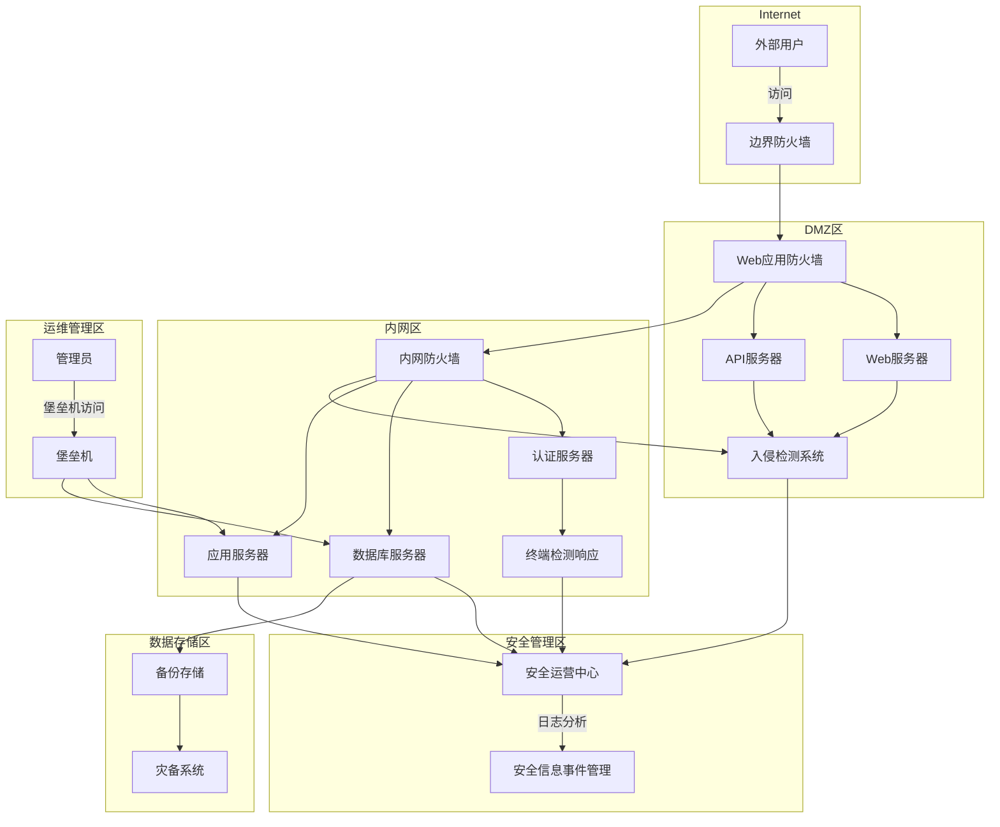

```mermaid
graph TD
    subgraph "Internet"
        A[外部用户] -->|访问| FW1[边界防火墙]
    end

    subgraph "DMZ区"
        FW1 --> WAF[Web应用防火墙]
        WAF --> Web[Web服务器]
        WAF --> API[API服务器]
        Web --> IDS1[入侵检测系统]
        API --> IDS1
    end

    subgraph "内网区"
        FW2[内网防火墙] --> AD[认证服务器]
        FW2 --> DB[数据库服务器]
        FW2 --> APP[应用服务器]
        AD --> EDR[终端检测响应]
    end

    subgraph "安全管理区"
        IDS1 --> SOC[安全运营中心]
        DB --> SOC
        APP --> SOC
        EDR --> SOC
        SOC -->|日志分析| SIEM[安全信息事件管理]
    end

    subgraph "数据存储区"
        DB --> Backup[备份存储]
        Backup --> DR[灾备系统]
    end

    subgraph "运维管理区"
        Admin[管理员] -->|堡垒机访问| Bastion[堡垒机]
        Bastion --> APP
        Bastion --> DB
    end

    %% 连接不同安全区域
    WAF --> FW2
    FW2 --> IDS1
```